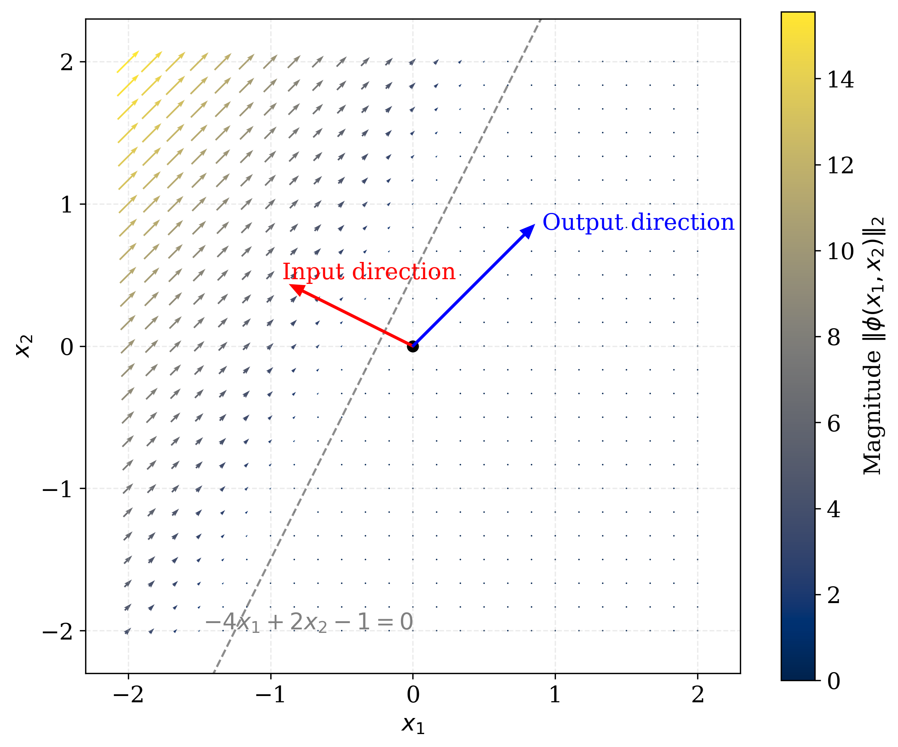
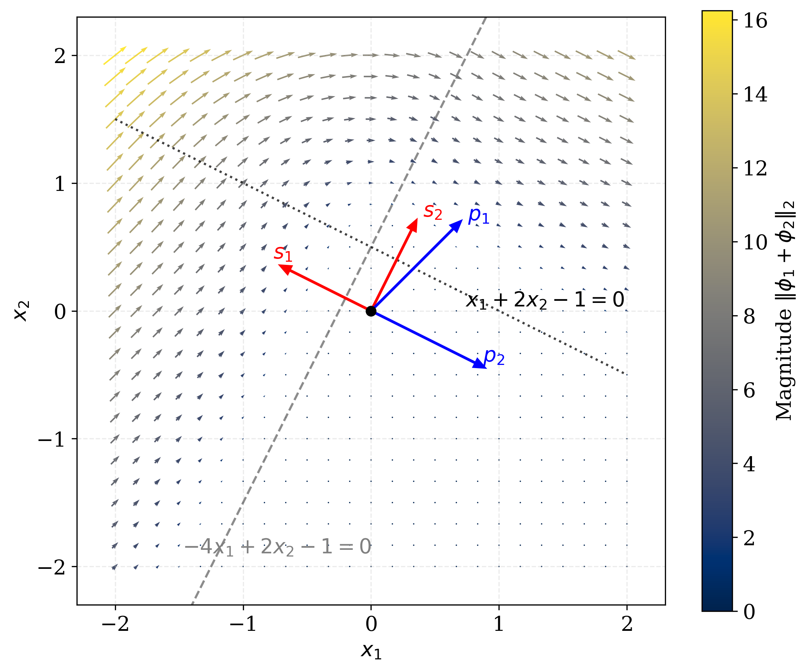

# Linear Reusable Neural Bases Architecture (LRNBA)

Official implementation accompanying the paper:

> **[A Mathematical Theory of Reusable Neural Bases for Network Compression](docs/LRNBA.pdf)**  

[//]: # (> Binshuai Wang, Peng Wei  )

[//]: # (> *International Conference on Learning Representations &#40;ICLR&#41;, 2025*)

## Overview

Large neural networks often achieve better performance by increasing model width and depth, but this comes with substantial parameter-memory costs during training and inference.

**Linear Reusable Neural Bases Architecture (LRNBA)** is a parameter-efficient framework that represents each network block as a **linear combination of a shared collection of neural bases**. Instead of learning an independent set of neurons for each block, LRNBA reuses the same collection of neural bases across depth and learns depth-dependent coefficients to construct different blocks.

The goal is to enable **wider and deeper neural networks under a limited parameter and memory budget**, while maintaining stable optimization and competitive performance.

## Key Idea

Consider a standard residual feedforward block

$$
x + R(x),
$$

where

$$
R(x)=P\sigma(Sx+b).
$$

Let the hidden dimension be $m$. Writing the rows of $S$, entries of $b$, and columns of $P$ as

$$
S^\top=[s_1,\ldots,s_m], \qquad
b^\top=[b_1,\ldots,b_m], \qquad
P=[p_1,\ldots,p_m],
$$

the residual component can be decomposed as

$$
R(x) = \sum_{j=1}^{m} \sigma(\langle x,s_j\rangle+b_j)p_j.
$$

Define

$$
\phi_j(x) = \sigma(\langle x,s_j\rangle+b_j)p_j
$$

as a **neural basis**. Then

$$
R(x)=\sum_{j=1}^{m}\phi_j(x).
$$

LRNBA reuses the same neural bases across depth. The residual block at depth $l$ is constructed as

$$
R_l(x) = \sum_{j=1}^{m} \alpha_{j,l}\phi_j(x),
$$

where $\alpha_{j,l}$ is a learnable coefficient controlling the contribution of neural basis $j$ at depth $l$.

## Architecture

LRNBA follows two principles:

1. **Neuron reuse:** the same neural basis can be reused across multiple network depths.
2. **Linear construction:** each network block is dynamically constructed as a linear combination of shared neural bases.

The architecture contains:

- reusable neural bases $\{\phi_j\}_{j=1}^{m}$;
- a coefficient table $\{\alpha_{j,l}\}$ over basis index and network depth.

Because the coefficient table is much smaller than storing independent full-weight matrices for every block, the parameter count becomes almost decoupled from network depth.

## Forward Pass

For an FFN-based residual network:

```text
for each depth i:
    a = reused_sensors(x)
    a = GELU(a)
    a = a * coefficient_table[:, i]
    a = reused_responses(a)
    x = x + a
```

The shared sensor and response layers define the reusable neural bases, while the coefficient table generates different effective residual blocks at different depths.

## Training Strategy

Because the neural bases are reused across multiple blocks, their gradients accumulate over all reuse positions.

To keep update magnitudes comparable to conventional networks, LRNBA rescales gradients of reused parameters by the number of reuse positions:

```text
def average_gradients(layers, depth):
    # Average gradients accumulated from repeated block applications.
    for p in layers.parameters():
        p.register_hook(
            lambda grad, depth=depth: grad / depth
        )
```

The coefficient-table parameters are updated directly without this rescaling.

### Initialization

The paper uses:

- **Sensor layers:** Kaiming initialization
- **Response layers:** zero initialization
- **Coefficient table:** standard Gaussian initialization $\mathcal{N}(0,1)$

Simultaneously zero-initializing both response layers and the coefficient table should be avoided because their bilinear interaction would cause gradients to vanish.

## Geometric Interpretation

Each neural basis

$$
\phi_j(x) = \sigma(\langle x,s_j\rangle+b_j)p_j
$$

can be interpreted as a vector field from input space to output space:

- $s_j$ determines the input direction,
- $b_j$ determines the offset,
- $p_j$ determines the output response direction.

A residual block can therefore be viewed as a **superposition of vector fields generated by multiple neural bases**.

Neural-Basis Visualizations

<p align="center">
  
  
</p>
<p align="center">
  <em>Left: vector field induced by a single neural basis. Right: superposition of two neural bases, illustrating how multiple directional effects can produce more complex dynamics.</em>
</p>


## Attention Neural Bases

The neural-basis concept also extends to multi-head attention.

For attention head $j$,

$$
A_j(x) = \operatorname{softmax} \left(\frac{q_jk_j^\top}{\sqrt{d_H}} \right)v_j,
$$

where

$$
q_j=Q_jx,\qquad k_j=K_jx,\qquad v_j=V_jx.
$$

Each attention head can be viewed as an **attention neural basis**. A coefficient-weighted attention block is

$$
\operatorname{Attn}_{\alpha}(x)= \operatorname{Concat} \left(\alpha_1A_1(x),\ldots,\alpha_HA_H(x)\right)O.
$$

## Projection Neural Bases

A projection block can be decomposed as

$$
P(Sx+b)= \sum_{j=1}^{m} (\langle x,s_j\rangle+b_j)p_j.
$$

Each projection basis

$$
\phi_j(x)= (\langle x,s_j\rangle+b_j)p_j
$$

corresponds to the rank-one affine transformation

$$
\phi_j(x)= p_js_j^\top x+p_jb_j.
$$

## Sub-Neural Reuse

LRNBA can further reduce parameter count by sharing components below the neuron level.

One example is a **multi-sensor neuron**, in which multiple sensor functions share one response vector. This finer-grained reuse can reduce parameters, enlarge the active domain of a neuron, and alleviate dead-neuron behavior.

## Advantages

- **Parameter efficiency:** reusable bases reduce the number of independently stored parameters.
- **Depth scalability:** parameter count is almost decoupled from depth.
- **Flexible width expansion:** more virtual neurons can be constructed from reusable bases.
- **Stable optimization:** experiments show stable training despite extensive reuse.
- **Compatibility:** the framework extends to FFN, attention, and projection components.

## Experiments

The paper evaluates LRNBA in two settings:

1. FFN-based ResNet for nonlinear function approximation
2. Decoder-only Transformer for language modeling

All experiments were conducted on a workstation with:

- Intel Core i7 CPU
- 16 GB system RAM
- NVIDIA RTX 3090 GPU

## FFN-Based ResNet

### Dataset

Target function:

$$
f(x)=\cos(\cos x).
$$

- Samples: 60,000
- Domain: $[-1,1]$
- Train/test split: 3:1

### Training Setup

- Epochs: 2048
- Batch size: 512
- Optimizer: AdamW
- Learning rate: $1\times10^{-5}$
- Loss: MSE

### Baseline Architecture

- Depth: $L=8$
- Embedding dimension: $d=64$
- Hidden dimension: $m=256$

### Test Results

| Model | Parameters | Test MSE |
|---|---:|---:|
| LRNBA, $4L$ | 41.4K | $3.04\times10^{-6}$ |
| LRNBA | 35.3K | $2.88\times10^{-5}$ |
| LRNBA, $4m$ | 140.5K | $3.19\times10^{-5}$ |
| Classical ResNet | 264.4K | $4.06\times10^{-5}$ |
| Classical, quarter width | 66.2K | $2.99\times10^{-4}$ |
| One shared residual block | 33.2K | $1.47\times10^{-3}$ |
| Classical, quarter depth | 66.2K | $3.67\times10^{-1}$ |

The results show that depth expansion gives larger gains than width expansion in this experiment. The $4L$ LRNBA model achieves the lowest test MSE while using far fewer parameters than the classical ResNet.

## Decoder-Only Transformer

### Dataset and Tokenization

- Dataset: WikiText-2
- Tokenizer: byte-level BPE
- Vocabulary size: 16,384
- Sequence length: 128

### Base Transformer

- Embedding dimension: $d=512$
- Depth: $L=8$
- Attention heads: $H=8$
- Head dimension: 64
- FFN hidden dimension: 2048
- Dropout: 0

### Training Setup

- Epochs: 800
- Batch size: 16
- Training batches per epoch: 512
- Test batches: 128
- Optimizer: AdamW
- Learning rate: $1.5\times10^{-5}$
- Evaluation metric: cross-entropy loss

### Model Comparison

| Model | Parameters | Average Time / Epoch |
|---|---:|---:|
| Classical Transformer | 42.27M | 24.126 s |
| LRNBA $2h2m$ | 23.36M | 37.040 s |
| LRNBA $4h4m$ | 29.66M | 62.656 s |
| LRNBA $6h6m$ | 35.97M | 86.877 s |

Increasing the number of reusable attention and FFN bases consistently accelerates convergence and lowers the final training loss. The $6h6m$ model achieves the fastest convergence and lowest training loss while using about three-quarters of the parameters of the classical Transformer.

## Training-Time Trade-Off

LRNBA reduces parameter-memory requirements at the cost of additional computation during training.

Because blocks are dynamically constructed from reusable neural bases and depth-dependent coefficients, increasing the number of bases can increase per-epoch training time.

During inference, this overhead can be reduced by **precomputing and caching the effective weights for each block**.

## Neural-Basis Energy and Pruning

The coefficient table provides a natural measure of basis importance:

$$
E(\phi_j)= \sum_{l=1}^{L}\alpha_{j,l}^{2}.
$$

Bases with low energy may contribute less to the model and could potentially be pruned for further compression.

## Main Contributions

LRNBA introduces:

- reusable neural bases for parameter-efficient network construction;
- neuron-level parameter sharing across depth;
- a geometric vector-field interpretation of neural computation;
- attention neural bases;
- projection neural bases;
- sub-neural reuse;
- near-decoupling of parameter count from network depth;
- the ability to build substantially wider and deeper models under a limited parameter budget.

## Limitations

The primary limitation is increased training time and energy consumption. Dynamically constructing block-specific transformations introduces additional computation during training, especially as the number of reusable bases grows.

The paper notes that this overhead can be eliminated during inference by precomputing and caching effective block weights.

## Repository Usage

Repository-specific installation commands, file structure, and command-line interfaces are not specified in the paper. Add them here once finalized:

```bash
# Install dependencies
# pip install -r requirements.txt

# Run FFN-based ResNet experiments
# python ...

# Run Transformer experiments
# python ...
```

## Citation

If you find this work useful, please cite:

```bibtex
@misc{wang2026mathematicaltheoryreusableneural,
      title={A Mathematical Theory of Reusable Neural Bases for Network Compression}, 
      author={Binshuai Wang, Peng Wei},
      year={2026},
      eprint={2609.01550},
      archivePrefix={arXiv},
      primaryClass={cs.LG},
      url={https://arxiv.org/abs/2609.01550}, 
}
```

## Authors

**Binshuai Wang**  
**Peng Wei**

Department of Computer Science  
The George Washington University  
Washington, D.C., USA

